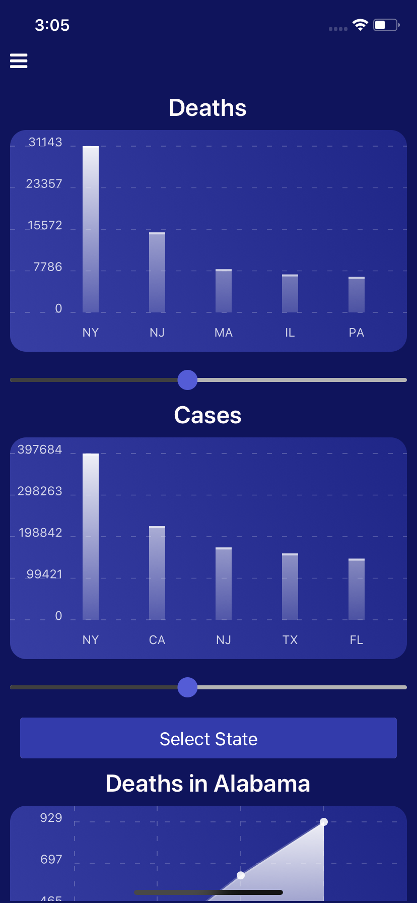
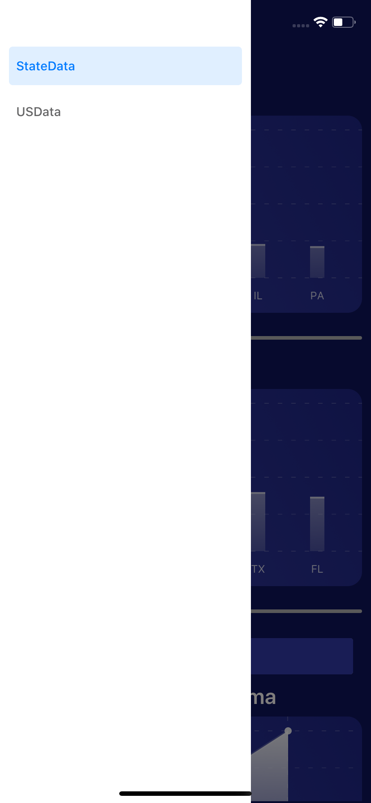
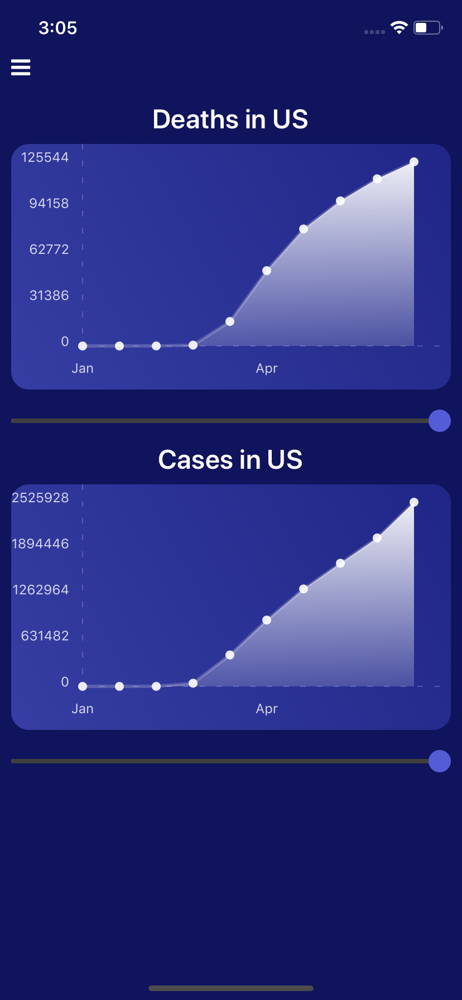

# Covid Data Mobile App




## Setup

Make sure your environment is set up according to the react native [documentation](https://reactnative.dev/docs/environment-setup)

This project was generated with react-native.

## Getting Started

### Prerequisites

- A package manager like [npm](https://www.npmjs.com/)
- [Node.js](https://nodejs.org/en/)
- [Watchman] (https://facebook.github.io/watchman/docs/nodejs/)


### Installing

Run these commands in the terminal:

```
npm run install

cd ios

pod install

npm run ios
```

The app should automatically in your simulator.

### Completed Features

- [x] Request data from New York Times repo.
- [x] Graph data using react-native-chart-kit.
- [x] Add interactive elements to graphs.
- [x] Routing with react-navigator.

### Next Steps

- [ ] Deploy to the Apple app store and Google Play store.

## Built With

React Native

## Author

Brendt Bly

## Acknowledgments

The New York Times has made their Covid-19 [data](https://github.com/nytimes/covid-19-data) available on github.  It's a great resource for researchers.
